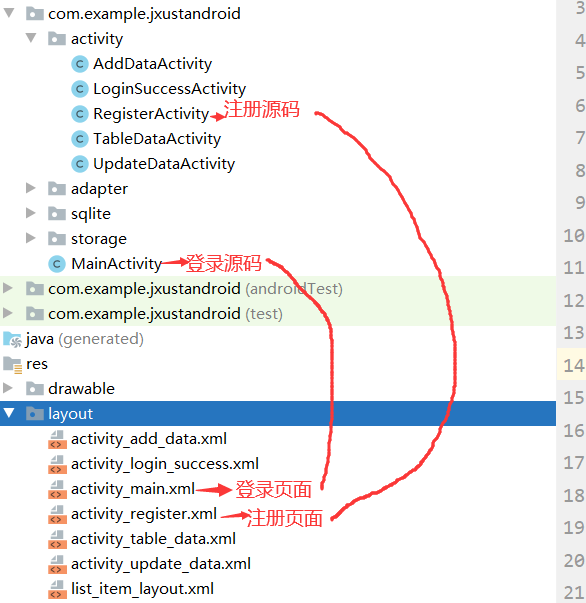

# 前言

这是一个公开项目，请勿直接拿来用和截图，一切仅供参考。后果自负。

# 项目

> 上有政策,下有对策
>
> 不是自己的,那我就换成自己的

1. 更换logo（非常重要）

   

2. 更换文字（非常重要）

   

3. 换颜色

   > 这里只是换背景颜色,要详细更改,需要自己到layout对每个页面更改

   

4. 换名字(次要)

   > 将类名,文件名啊! 换成自己的取的名字,防止项目源码一模一样
   >
   > 注: 一定要用IDE（Android Studio）来改名

   

5. 其他

   > 上面的几步操作,只不过给是项目换了一层皮而已
   >
   > 只能自己写的,才是自己的

# 实验

## 实验一 

1. 前言

   > 登录和注册选一个写就OK了

   

2. 效果图

   

## 实验二

1. 前言

   

2. 效果图

   

   

## 实验三

1. 前言

   

   

   

   

2. 效果图

   

   

   

   ## 实验四

   1. 前言

      

   2. 效果图

      

